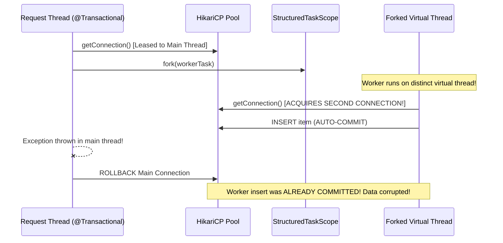

# Concepts: Spring Transactions on Java 25 & Boot 4

!!! info "Delta from baseline"
    Baseline concepts in [`docs/topics/spring-transactions/concepts.md`](../../../topics/spring-transactions/concepts.md) detail `@Transactional` proxy interception, ACID properties, propagation, and isolation levels.
    This page covers the **modern concurrency and virtual thread interaction**: thread-confinement of Spring transactions, connection lease economics, and scoped metadata propagation.

---

## 1. The Thread-Bound Nature of `@Transactional`

A frequent misconception when adopting Java 25 Virtual Threads is assuming that `@Transactional` automatically spans child virtual threads or tasks forked within a `StructuredTaskScope`.

Spring transactions rely on `TransactionSynchronizationManager`:
- Database connections (`ConnectionHolder`) are bound to the current thread via `ThreadLocal`.
- Child virtual threads forked within a `StructuredTaskScope` **do not inherit the active database transaction or connection**.
- If a child thread performs database access, it either acquires a new connection from the pool (running in auto-commit mode or a separate transaction) or fails with a context error.

---

## 2. Safe Transaction Orchestration Pattern

To safely combine parallel subtask fan-out with database transactions:

1. **Short Atomic Database Updates**: Execute database writes within short, isolated transaction blocks.
2. **Parallel Network Calls Outside DB Locks**: Execute `StructuredTaskScope` fan-out calls (e.g. inventory reservation, fraud checks, payment gateway calls) without holding a database connection.
3. **Commit State Updates**: Once external verifications succeed, record final state updates in another short atomic transaction.

---

## 3. Scoped Value Context Propagation

While database transactions remain thread-bound, transaction correlation IDs, tenant keys, and audit headers can be safely passed to virtual workers using **`ScopedValue`**:
- Zero memory allocation overhead when forking thousands of tasks.
- Bounded to the execution scope with zero manual `finally { tl.remove(); }` cleanup.
