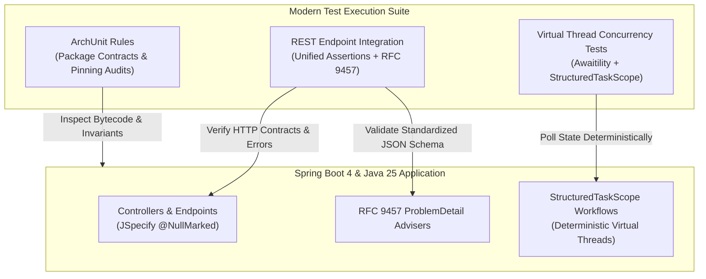

# Testing Modernization in Spring Boot 4 / Spring Framework 7 & Java 25

!!! info "Delta from baseline"
    Baseline module [`modules/12-testing`](../../../topics/testing/index.md) covers testing fundamentals: JUnit 5, AssertJ, Mockito, Spring Boot test slices (`@WebMvcTest`, `@DataJpaTest`), Testcontainers, WireMock, and Awaitility on Spring Boot 3.5 and Java 21.
    This track module teaches the **Spring Boot 4.0 / Spring Framework 7 & Java 25 delta**:
    
    - **Unified Web Testing Client**: Transitioning from fragmented test clients (`MockMvc`, `WebTestClient`) to modern unified REST testing patterns, asserting RFC 9457 `ProblemDetail` payloads directly.
    - **Deterministic Virtual Thread Testing**: Eliminating arbitrary `Thread.sleep` anti-patterns in asynchronous test suites, using poll-based synchronization (`Awaitility`) and verifying `StructuredTaskScope` subtask failure and cancellation behavior.
    - **ArchUnit Rules for Java 25 & JSpecify**: Enforcing modern architectural constraints, including `@NullMarked` package contracts and prohibiting anti-patterns like carrier thread pinning.

---

## 1. Modern Testing Architecture

---

## 2. Feature Comparison Matrix

| Capability | Baseline (Boot 3.5 / Java 21) | Track (Boot 4.0 / Java 25) |
|---|---|---|
| **Web Endpoint Testing** | Separate `MockMvc` (blocking MVC) vs `WebTestClient` (reactive / WebFlux) | Unified fluent REST test clients asserting JSON contracts and HTTP responses |
| **Error Contract Assertions** | Ad-hoc `jsonPath("$.status")` or plain text matching | Native RFC 9457 `ProblemDetail` structure and extension property verification |
| **Asynchronous Verification** | Often plagued by brittle `Thread.sleep` delays in legacy tests | Poll-based deterministic verification via `Awaitility` and structured task scopes |
| **Structured Concurrency Tests** | `CompletableFuture` callback chains or `Future.get()` blocking | `StructuredTaskScope` subtask state verification (`SUCCESS`, `FAILED`) and fail-fast joins |
| **Architecture Verification** | Basic layer dependency checks | Java 25 package boundary enforcement, nullness contract compliance, and carrier thread safety |

---

## 3. Module Roadmap

1. [Concepts](concepts.md) — Unified REST client testing, deterministic virtual thread verification, and ArchUnit invariants.
2. [Internals](internals.md) — How test runners synchronize with virtual threads and how RFC 9457 errors are mapped in test contexts.
3. [Interview Questions](questions.md) — 13 senior and scenario questions with runnable demonstrations.
4. [Code Review](code-review.md) — Review targets exhibiting unbound test concurrency and assertion drift.
5. [Solutions](solutions.md) — Production refactoring guide with issue catalogue mappings.
6. [Testing Guide](tests.md) — Writing robust unit and integration tests without flaky timeouts.
7. [Production Scenarios](production.md) — Diagnosing flaky CI builds caused by thread race conditions.
8. [Exercises](exercises.md) — Hands-on migration exercises.
