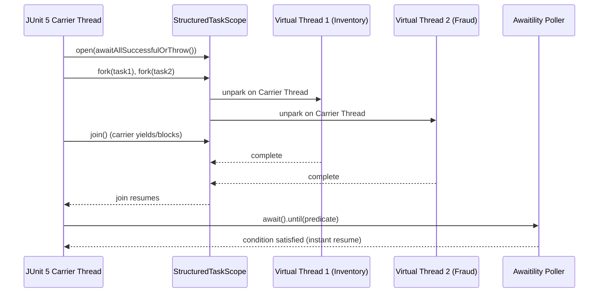

# Testing Internals in Spring Boot 4 & Java 25

!!! info "Delta from baseline"
    Baseline module [`modules/12-testing`](../../../topics/testing/internals.md) explains JUnit 5 test lifecycle, TestContext framework execution listeners, and Spring bean mocking internals.
    This page dives into the runtime mechanics of virtual thread scheduling during test execution and RFC 9457 error response generation.

---

## 1. Virtual Thread Scheduling in Test Environments

Virtual threads in Java 25 execute on top of a `ForkJoinPool` of carrier threads (defaulting to available CPU cores). Understanding how test executors interact with this scheduler is critical:

### The Pitfall of `Thread.sleep` vs Polling
When a test thread calls `Thread.sleep(200)`:
1. The test runner thread yields for an arbitrary fixed wall-clock interval regardless of whether the background virtual thread completed in 2ms.
2. In resource-constrained CI agents with CPU throttling, 200ms may expire before the virtual thread gets scheduled on a carrier thread, leading to intermittent test failures.
3. Conversely, Awaitility executes an active loop with exponential backoff or tight intervals (e.g. 10ms), resuming immediately once the condition is met and cutting test suite execution time by up to 90%.

---

## 2. Spring WebMvc ProblemDetail Serialization Internals

When a controller throws an exception mapped to `ProblemDetail`:
1. Spring's `HandlerExceptionResolver` intercepts the exception.
2. `ResponseEntityExceptionHandler` or custom `@ExceptionHandler` produces a `ResponseEntity<ProblemDetail>`.
3. The Jackson `ObjectMapper` serializes standard RFC 9457 fields (`type`, `title`, `status`, `detail`, `instance`) and flattens any entries added via `ProblemDetail.setProperty(key, value)` into top-level JSON keys.
4. Test frameworks (like `MockMvc` with `jsonPath`) evaluate expressions directly against this flattened payload, guaranteeing end-to-end format compliance.
