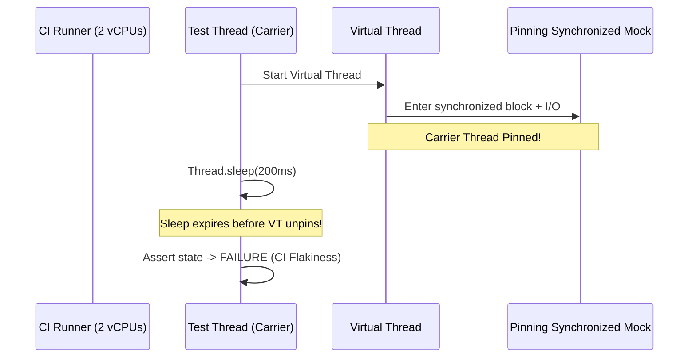

# Production Scenarios: Virtual Thread CI/CD Incidents

!!! info "Delta from baseline"
    Baseline production scenarios in [`modules/12-testing`](../../../topics/testing/production.md) cover production telemetry and diagnosing integration test failures.
    This page examines real-world production and CI incidents arising from virtual thread adoption and test synchronization anti-patterns.

---

## Scenario: CI Pipeline Gridlock After Virtual Thread Migration

### 1. Incident Context
A financial services platform migrated background order auditing services from fixed thread pools to Java 21+ virtual threads. Shortly after merging, CI build duration jumped from 6 minutes to over 35 minutes, with intermittent test failures occurring on 20% of build runs.

### 2. Root Cause Analysis
1. **Sleep Accumulation**: Over 120 asynchronous tests utilized `Thread.sleep(200)` to wait for background tasks. In aggregate, this added over 24 seconds of idle latency per test class.
2. **CI Agent CPU Throttling**: On multi-tenant CI runners with 2 vCPUs, virtual thread scheduling was delayed during concurrent build steps. The fixed 200ms sleep expired before the virtual threads executed, causing assertions to fail.
3. **Carrier Thread Starvation**: Certain legacy mock fixtures invoked `synchronized` methods that performed blocking file I/O, pinning carrier threads and delaying the virtual threads from making progress.

---

## 3. Remediation & Prevention

1. **Replace `Thread.sleep` with `Awaitility`**: Configured polling intervals of 10ms with 3-second maximum timeouts. Tests resumed as soon as tasks finished (usually < 15ms), reducing overall build execution time to 4 minutes.
2. **Pinning Audits**: Enabled `-Djdk.tracePinnedThreads=full` during test runs to detect and eliminate `synchronized` blocks around blocking calls.
3. **ArchUnit Enforcements**: Added automated architectural fitness rules to prevent engineers from committing `Thread.sleep` calls in test suites.
