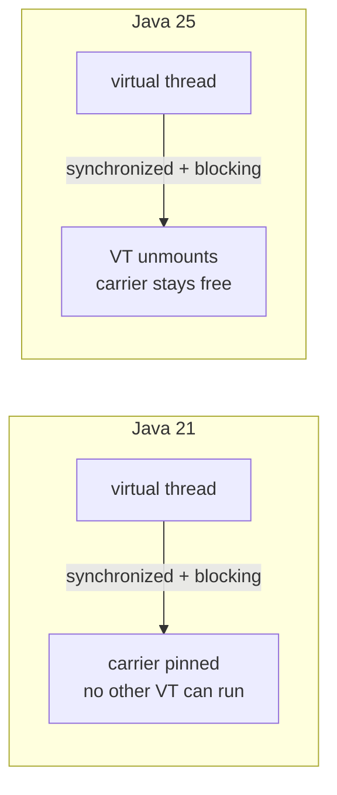

# What's New in Java 22 → 25

Delta from the baseline (Java 21) to Java 25 LTS. Only changes that affect a backend service are
listed; language trivia is left out. Everything below links to the baseline concept it extends.

!!! info "Delta from baseline"
    Unchanged: Java 21 language semantics, collections, streams, `equals`/`hashCode`, generics,
    exceptions → [Core Java](../../topics/core-java/concepts.md)
    Changed: virtual thread pinning, GC defaults, deprecations that now warn
    New: stream gatherers, flexible constructor bodies, primitive patterns, module imports

## Feature map

| Java | JEP | Feature | Status on 25 | Backend impact |
|---|---|---|---|---|
| 22 | 456 | Unnamed variables and patterns | Final | Removes noise from `catch`, loops, lambdas |
| 22 | 454 | Foreign Function & Memory API | Final | Replaces JNI; native clients without C glue |
| 23 | 467 | Markdown documentation comments | Final | Javadoc readable in source |
| 23 | 474 | Generational ZGC by default | Final | Lower GC pauses for heap-heavy services |
| 24 | 485 | Stream gatherers (`Stream::gather`) | Final | Custom intermediate ops: windowing, folding, scanning |
| 24 | 484 | Class-File API | Final | Frameworks that read/write bytecode |
| 24 | **491** | **Synchronize virtual threads without pinning** | Final | `synchronized` no longer pins a carrier thread |
| 24 | 486 | Permanently disable the Security Manager | Final | `SecurityManager` code must go |
| 24 | 498 | Warn on `sun.misc.Unsafe` memory access | Final | Warnings today, removal later |
| 25 | 482 | Flexible constructor bodies | Final | Validate/normalise **before** `super(...)` |
| 25 | 506 | Scoped values | Final | Safer alternative to `ThreadLocal` for request context |
| 25 | 511 | Module import declarations | Final | `import module java.base;` in modular code |
| 25 | 512 | Compact source files, instance `main` | Final | Scripts and examples without boilerplate |
| 25 | 507 | Primitive types in patterns | **Preview** | `case int i when ...` in `switch` |
| 25 | 505 | Structured concurrency | **Preview** | `StructuredTaskScope` — see module 03 |
| 25 | 503 | Remove the 32-bit x86 port | Final | Build images on x86-64/arm64 only |
| 25 | 519 | Compact object headers | Final | Smaller objects, less heap pressure |

!!! warning "Preview features need a flag"
    Primitive types in patterns and structured concurrency are **preview** on Java 25. The track's
    convention plugin compiles and tests with `--enable-preview`; production code should not ship
    preview APIs without accepting that risk.

## The change that breaks existing workarounds

Java 21 gave a clear rule: *do not block inside `synchronized` on a virtual thread*, because the
blocked virtual thread pinned its carrier. Teams rewrote `synchronized` into `ReentrantLock`
everywhere. On Java 24+ that workaround is obsolete.

The consequence is not "use `ReentrantLock` everywhere" — it is the opposite: **revert gratuitous
lock rewrites**. A hand-written `ReentrantLock` that forgets `try`/`finally` is strictly worse than
the `synchronized` it replaced. See
[Code Review: obsolete pinning refactor](core-java/code-review.md#obsolete-pinning-refactor).

## What to re-test after the upgrade

- **Locking code** — remove pinning workarounds; keep `ReentrantLock` only where you need
  `tryLock`, fairness or multiple conditions.
- **Thread-local context** — `ThreadLocal` still works, but scoped values are the better fit for
  request-scoped data on virtual threads.
- **GC tuning flags** — generational ZGC is the default mode; re-check any `-XX` tuning inherited
  from Java 21.
- **Reflection and `Unsafe`** — expect deprecation warnings; track them before they become errors.
- **Security Manager usage** — it is permanently disabled; remove or replace the code path.

## Trade-offs

| Choice | Gain | Cost |
|---|---|---|
| Stream gatherers over hand-written loops | Reusable, composable, parallel-safe intermediate ops | New API; `gather` is harder to read than a loop for simple cases |
| Flexible constructor bodies | Fail fast before `super(...)` runs; no half-built objects | Validation now lives in the constructor, not a factory |
| Primitive patterns | Exhaustive `switch` over primitives | **Preview**; implicit narrowing still truncates silently |
| Scoped values | Immutable, bounded request context | Not a drop-in for mutable `ThreadLocal` state |

## Interview questions

- Which Java 21 virtual-thread workaround became obsolete in Java 24, and why is keeping it
  dangerous?
- Your team has `-XX:+UseZGC` from Java 21. What changes on Java 25?
- Which Java 25 features are preview-only, and what does that mean for a production service?

Full delta question bank: [Core Java delta questions](core-java/questions.md).

## Related

- [What's new in Spring Boot 3.5 → 4.0](whats-new-spring-boot.md)
- [Migration guide](migration.md)
- [Baseline Core Java](../../topics/core-java/index.md)
