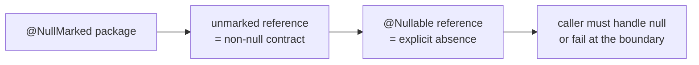

# What's New in Spring Boot 3.5 → 4.0

Delta from the baseline (Spring Boot 3.5.x) to Spring Boot 4.0 / Spring Framework 7. This page
lists the changes that force code or configuration edits during an upgrade; behaviour that is
unchanged links to the baseline.

!!! info "Delta from baseline"
    Unchanged: dependency injection, the proxy model behind `@Transactional`, MVC request
    handling, JPA repository semantics → [Spring Core](../../topics/spring-core/index.md)
    Changed: nullness annotations, API versioning, HTTP client defaults, security DSL, test slices
    New: `RestTestClient`, core retry, Jackson 3 support

## Change map

| Area | What changes | Migration action |
|---|---|---|
| Platform baseline | Jakarta EE 11 (Servlet 6.1, JPA 3.2, Bean Validation 3.1) | Bump Jakarta artifacts; re-run integration tests |
| Null safety | JSpecify annotations (`@NullMarked`, `@Nullable`) replace the old `@NonNullApi`/`@NonNullFields` | Migrate package-level nullness; fix new warnings |
| API versioning | First-class `version` attribute on `@RequestMapping`, resolved by the framework | Delete hand-rolled header/path version parsers |
| HTTP clients | New defaults for `RestClient` / HTTP interface clients | Re-check timeouts, redirects and error handling |
| Retry | Retry moves into core (`@Retryable`, `RetryTemplate`) | Decide core retry vs Resilience4j — see module 18 |
| JSON | Jackson 3 (`tools.jackson`) supported; Jackson 2 is legacy | Re-check custom serializers and module registration |
| Security | Spring Security 7: lambda-only DSL, deprecations removed | Rewrite `and()` chains and removed methods |
| Data | Spring Data 4, Hibernate 7 / JPA 3.2 | Re-check `@Query`, fetch semantics and nullability |
| Messaging | Spring Kafka 4 / Spring AMQP 4 client baselines | Re-test consumer groups, offset commits, listener containers |
| Testing | `RestTestClient` for MVC; revised test slices | Replace `MockMvc`-plus-`WebTestClient` duplication |
| Observability | Micrometer/Observation defaults, Actuator endpoint changes | Re-check endpoint exposure and metric names |
| Auto-configuration | Deprecated properties and auto-configurations removed | Run with `--debug` and fix every "no longer valid" property |

!!! warning "Verify against your patch release"
    Spring Boot 4.0 spans several patch releases. Treat this table as the *shape* of the migration
    and confirm exact property and annotation names against the release notes for the version you
    pin in `tracks/java25-boot4/gradle/libs.versions.toml`.

## Nullness becomes part of the API

JSpecify turns nullability into a declared contract instead of a comment. A package annotated
`@NullMarked` promises that every reference is non-null unless marked `@Nullable`.



The failure mode is subtle: a method that returns `null` in a `@NullMarked` package is now a
contract violation, even though the code still compiles. See
[Code Review: nullability contract violation](core-java/code-review.md) and the JSpecify section of
[What's new in Java](whats-new-java.md).

## API versioning moves into the framework

Spring MVC and WebFlux now resolve an API version for a request and match it against the `version`
attribute on handler mappings. Before the upgrade, teams wrote an interceptor or a custom
`RequestMappingHandlerMapping`; after it, that code is dead weight.

| Approach | Baseline (Boot 3.5) | Track (Boot 4) |
|---|---|---|
| Declaring versions | custom annotation + interceptor | `@RequestMapping(version = "1.2")` |
| Resolving the version | hand-written header/path parser | framework `ApiVersionResolver` |
| Rejecting unknown versions | manual `ResponseStatusException` | framework negotiation + problem details |

Trade-off: framework versioning standardises the mechanism, but it also fixes the *rules* (where the
version lives in the request). If your public API used an exotic scheme, you keep a custom resolver
rather than fight the default.

## Security: lambda-only DSL

Spring Security 7 removes the `and()` chaining that the baseline's Security 6 code may still use.
Configuration is written as nested lambdas:

```java
// Track (Security 7)
http.authorizeHttpRequests(auth -> auth.requestMatchers("/admin/**").hasRole("ADMIN"))
    .oauth2ResourceServer(oauth2 -> oauth2.jwt(Customizer.withDefaults()));
```

Removed methods fail at compile time — which is the good case. The dangerous case is a silently
changed default, such as a matcher that no longer applies. Re-run the authorization tests, not just
the compile.

## Trade-offs

| Choice | Gain | Cost |
|---|---|---|
| JSpecify everywhere | Nullability checked at compile time | Large annotation churn; new warnings on legacy code |
| Framework API versioning | One mechanism, one place to configure | Less freedom in how versions appear in the URL |
| Core `@Retryable` instead of Resilience4j | One dependency fewer | Fewer features (no circuit breaker, bulkhead, rate limiter) |
| Jackson 3 | Modern streaming, records support | Custom `Module`/serializer code must be ported |

## Interview questions

- You are upgrading Boot 3.5 → 4.0. What breaks at **compile time**, and what breaks only at
  **runtime**?
- How does JSpecify change the way you review a public API?
- When would you keep Resilience4j instead of the core retry support?

Full delta question bank: [Core Java delta questions](core-java/questions.md).

## Related

- [What's new in Java 22 → 25](whats-new-java.md)
- [Migration guide](migration.md)
- [Baseline Spring Boot](../../topics/spring-boot/index.md)
- [Baseline Spring Security](../../topics/spring-security/index.md)
