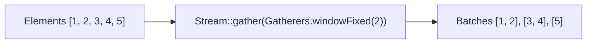

# Concepts: Java 25 & Spring Boot 4 Delta

!!! info "Delta from baseline"
    Baseline modules 01–30 establish production patterns on Java 21 LTS and Spring Boot 3.5.
    This page covers the core conceptual shifts introduced between **Java 22 → 25** and **Spring Boot 3.5 → 4.0**, highlighting what senior backend architects need to leverage and what migration risks to guard against.

---

## 1. Stream Gatherers (`Stream::gather`)

Before Java 24/25, Java Streams had a rigid structural limitation:
- `map` is strictly $1 \to 1$.
- `filter` is strictly $1 \to \{0, 1\}$.
- `flatMap` is $1 \to N$ stateless expansions.
- Terminal reduction (`collect`, `reduce`) processes all elements and ends the stream.

Intermediate operations had no clean, standard way to maintain state, chunk into windows, or emit values across element boundaries without writing parallel-unsafe collectors or relying on mutable state holders outside the pipeline.



**Stream Gatherers (JEP 473/485)** introduce user-defined intermediate stream operations:
- **`windowFixed(int windowSize)`**: Chunks the stream into fixed-size lists (e.g. batching database queries or Kafka sends). The final partial window is safely emitted upon stream termination.
- **`windowSliding(int windowSize)`**: Emits overlapping sliding windows (e.g. moving averages, trend analysis, rate-limit evaluation).
- **`scan(Supplier<R> initial, BiFunction<R, T, R> scanner)`**: Emits incremental running aggregates (e.g. running totals, event accumulation) without terminating the stream.
- **`fold(Supplier<R> initial, BiFunction<R, T, R> folder)`**: Aggregates the stream into a single downstream element as an intermediate step.
- **`mapConcurrent(int maxConcurrency, Function<T, R> mapper)`**: Concurrently processes elements up to a bounded concurrency ceiling using virtual threads.

---

## 2. Foreign Function & Memory (FFM) API vs. `sun.misc.Unsafe`

Off-heap memory allocation is critical for low-latency caching, zero-copy serialization, and cross-process IPC. Historically, backend libraries used `sun.misc.Unsafe` because direct `ByteBuffer` allocation lacked deterministic, immediate deallocation and had severe performance overhead.

### The Problem with `sun.misc.Unsafe`
1. **No Memory Bounds Checking**: Raw pointer arithmetic (`putLong(address + offset, value)`) allows writes to arbitrary native process memory. Off-by-one errors cause silent heap corruption, SIGSEGV crashes, or security vulnerabilities.
2. **No Ownership or Deterministic Lifetime**: Once allocated via `allocateMemory(bytes)`, the memory is completely untracked. If a pointer is dropped or an exception escapes, the memory leaks for the life of the OS process.
3. **Deprecation for Removal (JEP 498)**: In Java 23+, `sun.misc.Unsafe` memory-access methods emit stern compiler warnings and JVM runtime warnings. In subsequent releases, these methods throw `UnsupportedOperationException` and are removed.

### The Solution: FFM API (`java.lang.foreign`)
Finalized in Java 22 (JEP 454), the FFM API provides safe, structured off-heap access:
- **`Arena`**: Governs the lifecycle and deallocation of off-heap memory. 
  - `Arena.ofConfined()` bounds allocations to a single thread; deallocates immediately upon `arena.close()`.
  - `Arena.ofShared()` allows multi-threaded access while guaranteeing coordinated, deterministic release.
  - `Arena.ofAuto()` links memory lifecycle to GC garbage collection (similar to `ByteBuffer.allocateDirect`).
- **`MemorySegment`**: A safe view of a contiguous region of native or heap memory. All reads and writes (`get()`, `set()`) require explicit `ValueLayout` types (e.g., `ValueLayout.JAVA_LONG`) and automatically enforce spatial (bounds) and temporal (liveness) checks.

---

## 3. Permanent Removal of `SecurityManager` (JEP 486)

The `java.lang.SecurityManager` and `java.security.AccessController` APIs originated in the browser applet era (1995) to sandbox untrusted downloaded code. In modern containerized and microservice backends, JVM-internal code-level sandboxing is ineffective and incurs substantial runtime overhead:

```text
Java 17: SecurityManager deprecated for removal (-Djava.security.manager=allow)
Java 21: SecurityManager warning on startup
Java 25: SecurityManager permanently disabled (JEP 486)
         System.getSecurityManager() ALWAYS returns null.
         AccessController.checkPermission() is a NO-OP.
```

### The Migration Hazard: Fail-Open Authorization
Legacy Java libraries frequently implemented authorization gates like this:
```java
SecurityManager sm = System.getSecurityManager();
if (sm == null) {
    return true; // BUG: fail-open! On Java 25, sm is ALWAYS null!
}
```
When upgraded to Java 25, such gates become complete security bypasses. Security must be managed at application and network boundaries:
1. **Network/Infrastructure:** Linux namespaces, non-root Docker containers, Kubernetes network policies.
2. **Application:** Explicit, fail-closed principal-based authorization using Spring Security or domain authorization guards.

---

## 4. Virtual Thread `synchronized` Unpinning

In Java 21, when a virtual thread blocked on I/O or lock acquisition inside a `synchronized` block or method, it **pinned** its underlying carrier platform thread (`ForkJoinPool-worker`). Under high concurrency, this caused carrier starvation and service-wide deadlock.

In Java 25, HotSpot's `ObjectMonitor` implementation was re-engineered:
- When a virtual thread blocks inside `synchronized`, it yields its continuation cleanly.
- The carrier thread is immediately returned to the pool to service other virtual threads.
- When lock contention resolves, the virtual thread is rescheduled on any available carrier.

!!! tip "Refactoring Guidance"
    Defensive refactorings that converted `synchronized` to `ReentrantLock` solely to prevent Java 21 carrier pinning are now unnecessary. Reverting to `synchronized` or atomic primitives (`AtomicLong`) eliminates lock object allocations and avoids catastrophic lock leaks caused by missing `try-finally` blocks.

---

## 5. Spring Boot 4.0 / Spring Framework 7 Core Shifts

### Jakarta EE 11 Baseline
Spring Boot 4 baselines on Jakarta EE 11:
- Servlet 6.1 (virtual-thread native request processing).
- Persistence 3.2 / Hibernate 7.
- Validation 3.1.

### Configuration Properties Validation Strictness
In Spring Boot 3.5, unknown or renamed properties were frequently ignored silently during relaxed binding:
- If `notifications.outbound.topic` was renamed in Boot 4, a configuration bean with a `topic` field remained `null` at runtime.
- In Spring Boot 4, services must pair `@ConfigurationProperties` with `@Validated` and Jakarta validation constraints (`@NotBlank`, `@NotNull`, `@Positive`). This guarantees the application fails fast at startup if configuration keys do not match.

### JSpecify Nullness Standard
Spring Framework 7 transitions its null-safety annotations from JSR-305 / Spring-specific annotations to the standard **JSpecify** specification (`org.jspecify.annotations.*`).
- `@NullMarked` applied at class or package level declares that every reference is non-null by default.
- `@Nullable` explicitly marks opt-in nullability for parameters and return types, enforced by static analysis tools and IDEs.

### Native API Versioning & RestTestClient
- **Native Versioning:** Spring MVC and WebFlux introduce declarative, first-class API versioning via `@RequestMapping(version = "1.1")` and dedicated `ApiVersionResolver` strategies (header, query parameter, or media type).
- **`RestTestClient`:** A unified HTTP testing client replacing disparate MockMvc and WebTestClient assertions with a single, fluent assertion API that works seamlessly against mock environments or live HTTP servers.
