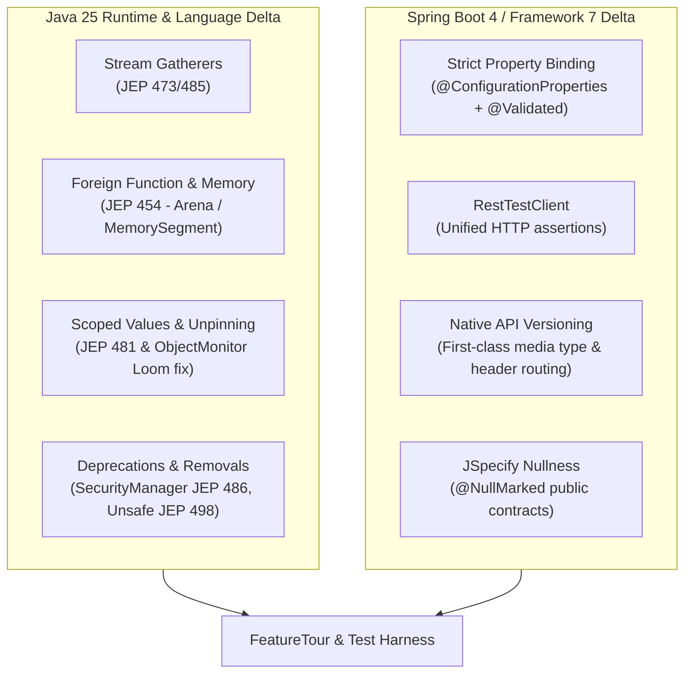

# Java 25 & Spring Boot 4: What's New Feature Tour

A runnable tour of the **Java 22 → 25** and **Spring Boot 3.5 → 4.0** changes that a senior backend engineer must master, alongside the migration hazards that turn routine version bumps into high-severity production incidents.

!!! info "Delta from baseline"
    Baseline modules 01–30 establish production-grade Java 21 and Spring Boot 3.5 architectures.
    This track-only module (Module 40) is the capstone and integration hub for the `java25-boot4` track:
    
    - **Unchanged:** Core architectural patterns, layered service boundaries, domain invariants, and REST API contract design.
    - **Changed:** Migration hazards where code compiles cleanly on Java 25 / Boot 4 but fails at runtime or under production load.
    - **New:** Runnable feature tour (`FeatureTour`), Foreign Function & Memory API replacing `sun.misc.Unsafe`, Stream Gatherers intermediate pipeline operators, permanently disabled `SecurityManager` (JEP 486), unpinned `synchronized` on virtual threads, and Spring Boot 4 property binding strictness.

---

## 1. What This Module Covers

Track-only Module 40 complements the track-level overview pages ([What's New in Java](../whats-new-java.md), [What's New in Spring Boot](../whats-new-spring-boot.md), and [Migration Guide](../migration.md)) with concrete, executable code and review targets:



1. **Stream Gatherers (`Stream::gather`)** — Stateful, windowed, and intermediate stream transformations (`windowFixed`, `windowSliding`, `scan`, `fold`) without parallel stream state corruption.
2. **Foreign Function & Memory API (`java.lang.foreign`)** — Safe, structured off-heap memory management with `Arena` and `MemorySegment`, replacing brittle and deprecated `sun.misc.Unsafe`.
3. **SecurityManager Deprecation for Removal (JEP 486)** — `System.getSecurityManager()` permanently returns `null`; eliminating fail-open and no-op `AccessController` authorization traps.
4. **Spring Boot 4 Configuration Property Safety** — Diagnosing silent configuration drops when properties are renamed or removed, and enforcing fail-fast startup validation with `@Validated` records.
5. **Virtual Thread `synchronized` Unpinning** — Understanding HotSpot's ObjectMonitor unmounting and safely reverting defensive `ReentrantLock` boilerplate.

---

## 2. Module Roadmap

1. [Concepts](concepts.md) — Comprehensive overview of Java 22–25 language/JVM capabilities and Spring Boot 4 architectural shifts.
2. [Internals](internals.md) — Deep-dive into memory segment lifecycle, the Gatherer protocol, ObjectMonitor continuation parking, and the Spring Boot 4 Binder engine.
3. [Interview Questions](questions.md) — 23 interview questions spanning Basic, Intermediate, Senior, and Incident Scenarios with runnable verification snippets.
4. [Code Review](code-review.md) — Three realistic pull-request review targets with intentional anti-patterns: `unsafe-offheap-buffer`, `security-manager-authorization`, and `boot4-renamed-property-silent`.
5. [Solutions](solutions.md) — Production-grade refactorings explaining root causes, corrective mechanisms, and architectural trade-offs.
6. [Testing Guide](tests.md) — Automated test suite verifying bounded memory deallocation, fail-closed authorization, and startup property validation.
7. [Production Scenarios](production.md) — Real-world outage triage, diagnostic commands, JFR event profiling, and pre-upgrade safety checklists.
8. [Exercises](exercises.md) — Hands-on migration exercises with hidden, expandable solutions.

---

## 3. Running the Tour

Execute the interactive feature tour directly from Gradle:

```bash
cd tracks/java25-boot4
../../gradlew :modules:40-whats-new:runFeatureTour
```

Run the unit tests and broken examples compilation verification:

```bash
cd tracks/java25-boot4
../../gradlew :modules:40-whats-new:test
../../gradlew :modules:40-whats-new:compileBrokenExamples
../../gradlew :modules:40-whats-new:compileExamples
```
