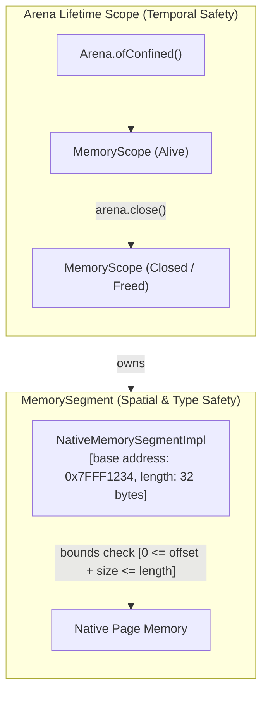
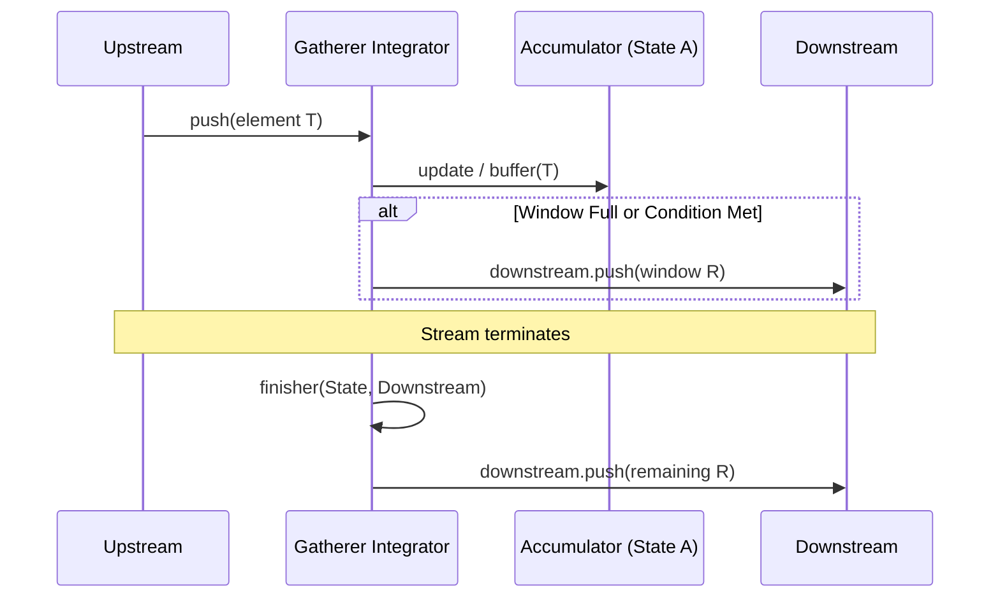
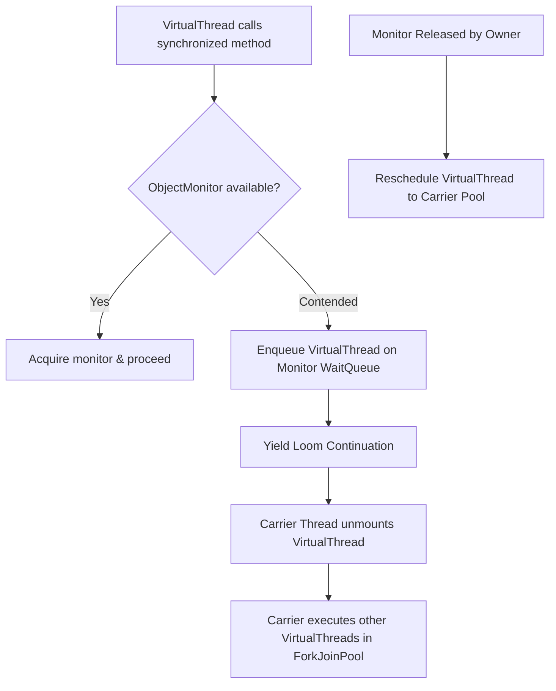
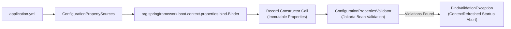

# Internals: Java 25 & Spring Boot 4 Architecture

!!! info "Delta from baseline"
    Baseline modules 01–30 describe Java 21 HotSpot internals and Spring Boot 3.5 bean lifecycles.
    This page examines the lower-level mechanics introduced in **Java 25** and **Spring Boot 4.0**, detailing how memory safety, stream coordination, virtual thread unpinning, and configuration validation work under the hood.

---

## 1. Foreign Function & Memory (FFM) Internals

The `java.lang.foreign` API is designed to deliver raw off-heap performance comparable to C/C++ while enforcing the Java Virtual Machine's type, temporal, and spatial safety guarantees.



### Spatial Safety (Bounds Checking)
When a segment is allocated via `arena.allocate(long byteSize, long byteAlignment)`:
1. HotSpot invokes the OS native allocator (e.g., `posix_memalign` or `aligned_alloc`), returning a native 64-bit base address.
2. An instance of `NativeMemorySegmentImpl` is constructed containing:
   - `long min`: The absolute memory address.
   - `long length`: The exact bounded allocation size.
   - `MemoryScope scope`: A reference to the owning arena's scope.
3. Every access via `segment.get(ValueLayout.JAVA_LONG, offset)` executes an intrinsic bounds check:
   $$\text{offset} \ge 0 \quad \land \quad (\text{offset} + \text{sizeof(Type)}) \le \text{length}$$
   If violated, the JVM throws `IndexOutOfBoundsException` before any memory load/store instruction is issued, preventing buffer overruns and memory corruption.

### Temporal Safety (Liveness Checking)
Each `MemoryScope` maintains an atomic state flag:
- While open, operations on segments belonging to the scope proceed with negligible synchronization overhead.
- When `arena.close()` is invoked:
  1. For confined arenas (`Arena.ofConfined()`), the JVM verifies that the calling thread is the owner thread; if not, an `WrongThreadException` is thrown.
  2. The scope state transitions atomically from `ALIVE` to `CLOSED`.
  3. The underlying memory is freed immediately via native `free(address)`.
  4. Subsequent read/write operations on any segment derived from that arena immediately throw `IllegalStateException: Already closed`.

---

## 2. Stream Gatherer Execution Protocol

A `Gatherer<T, A, R>` defines how elements are consumed, buffered, transformed, and emitted:
- `T`: Upstream element type.
- `A`: Intermediate state (accumulator) type.
- `R`: Downstream element type.



The protocol comprises four core functions:
1. **`initializer()`**: Returns a `Supplier<A>` that instantiates the internal state object (e.g., a buffer list for `windowFixed`).
2. **`integrator()`**: A `Gatherer.Integrator<A, T, R>` accepting `(state, element, downstream)`.
   - Returns `true` to request the next element from upstream.
   - Returns `false` to signal early termination (short-circuiting).
3. **`combiner()`**: Merges two intermediate state accumulators `(A, A) -> A` during parallel stream execution. If a gatherer is non-parallelizable, the combiner is omitted.
4. **`finisher()`**: Invoked exactly once when upstream terminates. Allows emitting any lingering buffered elements (such as the trailing incomplete window in `windowFixed`).

---

## 3. HotSpot `ObjectMonitor` Loom Unpinning

In Java 21, the Loom virtual thread runtime integrated with system calls (sockets, pipes) by delegating blocking calls to the continuation scheduler. However, entering a `synchronized` block locked an internal HotSpot `ObjectMonitor` structure tied to the OS pthread:

```text
Java 21 Monitor Entry:
VirtualThread -> ObjectMonitor::enter -> thread->set_pinned(true)
Blocking in monitor -> Carrier thread blocks on OS mutex (PINNED)
```

In Java 25, the HotSpot monitor acquisition path was rewritten:



When a virtual thread encounters contention on an `ObjectMonitor`:
1. It is enqueued onto the monitor's unmounted wait list.
2. HotSpot triggers `Continuation.yield()`, saving the virtual thread's register state and call frames into heap continuation chunks.
3. The carrier thread (`ForkJoinWorkerThread`) completely detaches from the virtual thread and returns to its work-stealing loop.
4. When the lock becomes free, the waking virtual thread is placed onto the carrier pool's task queue, resuming execution on any available carrier thread.

---

## 4. Spring Boot 4 Binder Engine & Validation Lifecycle

Spring Boot 4 refines the `@ConfigurationProperties` binding pipeline to support immutable records and strict fail-fast validation.

### Binding Phases


1. **ConfigurationPropertySources Loading**: Environment sources (properties files, environment variables, system properties) are normalized into `ConfigurationPropertyName` tokens (canonical hyphenated lower-case format).
2. **Constructor-Driven Binding**: If the target class is a Java record or has a single parameterized constructor, the `Binder` maps property tokens directly to constructor parameters. No mutable setters or zero-argument constructors are required.
3. **Validation Interception**: If the class is annotated with `@Validated`, Spring Boot registers a `ConfigurationPropertiesValidator` BeanPostProcessor.
4. **Startup Halt**: Immediately prior to `ApplicationReadyEvent`, all bound properties are evaluated against Jakarta Validation annotations (`@NotBlank`, `@NotNull`, `@Positive`). Any violation creates a `ConfigurationPropertiesBindException` wrapping the validation constraint failures, immediately aborting the startup sequence before the container accepts traffic.
