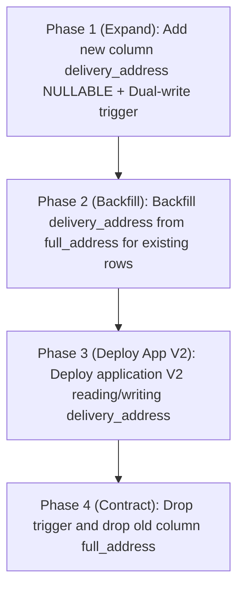

# Solution: Destructive Database Migration

## Annotated Code

### `V2__rename_customer_address_column.sql`
```sql
-- Reliability issue: Destructive schema migration (dropping/renaming columns directly) breaks backward compatibility with active rolling instances that still reference the old column
ALTER TABLE customers RENAME COLUMN full_address TO delivery_address;
```

---

## Issues Found

| Issue | Severity | Category | Description |
|---|---|---|---|
| Breaking Schema Migration | Critical | Reliability | Renaming or dropping a column in a single migration script breaks all currently running application instances during rolling zero-downtime deployments. |

---

## Remediation Strategy: The Expand and Contract Pattern

Zero-downtime schema evolution requires a multi-phase migration strategy:



1. **Phase 1 (Expand):** Add the new column without removing the old one:
   ```sql
   ALTER TABLE customers ADD COLUMN delivery_address VARCHAR(500);
   ```
2. **Phase 2 (Dual Write & Backfill):**
   Synchronize writes via database trigger or dual-write application logic, and backfill historical rows:
   ```sql
   UPDATE customers SET delivery_address = full_address WHERE delivery_address IS NULL;
   ```
3. **Phase 3 (Deploy App V2):** Deploy application version 2 that reads from `delivery_address`.
4. **Phase 4 (Contract):** Once all old application instances are retired, drop the old column:
   ```sql
   ALTER TABLE customers DROP COLUMN full_address;
   ```
