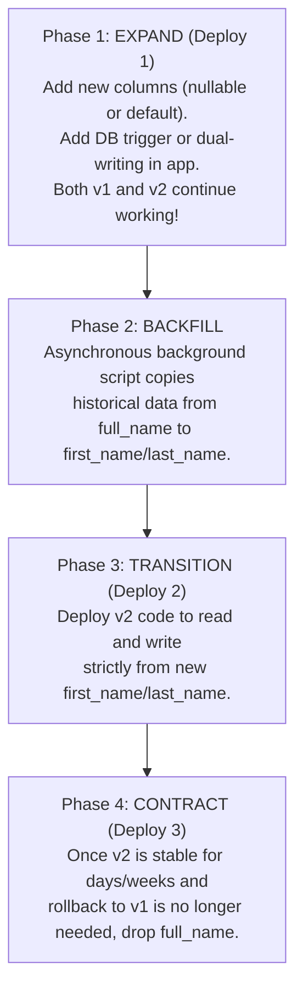

# Solution: Database Migration & Deployment Pipeline

## Annotated Targets

### `deploy-and-migrate.yml`
```yaml
name: Deploy Production Service

on:
  push:
    branches: [ main ]

jobs:
  deploy:
    runs-on: ubuntu-latest
    steps:
      - name: Checkout Code
        uses: actions/checkout@v4

      # Reliability issue: Running destructive database schema migrations before deploying new application code breaks running v1 instances.
      - name: Run Database Migrations
        env:
          DB_URL: ${{ secrets.PROD_DB_URL }}
          DB_USER: ${{ secrets.PROD_DB_USER }}
          DB_PASS: ${{ secrets.PROD_DB_PASS }}
        run: |
          ./gradlew flywayMigrate \
            -Dflyway.url="${DB_URL}" \
            -Dflyway.user="${DB_USER}" \
            -Dflyway.password="${DB_PASS}"

      - name: Deploy New Application Version
        run: |
          aws ecs update-service \
            --cluster production-cluster \
            --service customer-service \
            --force-new-deployment
```

### `V2__drop_old_columns.sql`
```sql
-- V2: Refactor customer full_name into first_name and last_name
ALTER TABLE customers ADD COLUMN first_name VARCHAR(100) NOT NULL DEFAULT '';
ALTER TABLE customers ADD COLUMN last_name VARCHAR(100) NOT NULL DEFAULT '';

-- Reliability issue: Synchronously dropping the legacy column in the same migration permanently breaks running v1 code and prevents rollback.
ALTER TABLE customers DROP COLUMN full_name;
```

---

## Discovered Issues

### Reliability issue: Breaking Backward Compatibility for Active $v1$ Instances
During any zero-downtime rolling deployment, canary rollout, or blue/green switch, version $v1$ and version $v2$ of the application **coexist simultaneously**:
1. When `./gradlew flywayMigrate` runs, it executes `ALTER TABLE customers DROP COLUMN full_name`.
2. Existing running containers (version $v1$) continue receiving production traffic.
3. As soon as a query runs (`SELECT id, full_name, email FROM customers` or a Hibernate query mapping `@Column(name = "full_name")`), PostgreSQL returns `PSQLException: column "full_name" does not exist`.
4. The service throws HTTP 500 Internal Server Errors across all active nodes until the new containers finish booting.

### Reliability issue: Eliminating Rollback Safety
If version $v2$ crashes on startup, fails database connection validation, or introduces a critical bug:
- The deployment is rolled back to version $v1$.
- However, because `full_name` was dropped and its historical data discarded, version $v1$ **cannot boot or run**.
- The entire production service remains hard down, requiring emergency manual data recovery from backups ($MTTR \ge 30-60\text{minutes}$).

---

## The Expand-Contract (Parallel Change) Pattern

Zero-downtime database migrations require separating schema evolution across multiple deployment phases:



See [`correct/`](correct/) for the multi-phase zero-downtime migration scripts and safe deployment pipeline.
