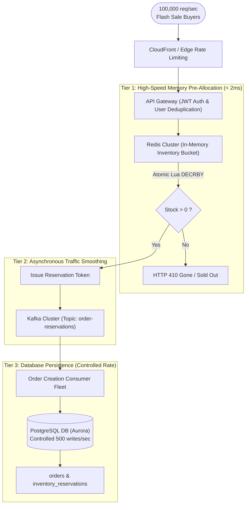

# Production System Design: Multi-Tier Flash Sale Inventory Architecture

## 1. Architectural Blueprint


## 2. Multi-Tier Operational Strategy
1. **Tier 1: Pre-warming & Atomic Redis Lua Pre-Allocation**:
   - Hours before the sale, inventory (10,000 units) is loaded into an in-memory Redis key.
   - An atomic Lua script decrements the counter and records user reservation IDs:
     ```lua
     -- Atomic stock decrement and user deduplication
     if redis.call('SISMEMBER', KEYS[2], ARGV[1]) == 1 then
         return -1 -- User already purchased
     end
     local stock = tonumber(redis.call('GET', KEYS[1]) or 0)
     if stock >= tonumber(ARGV[2]) then
         redis.call('DECRBY', KEYS[1], ARGV[2])
         redis.call('SADD', KEYS[2], ARGV[1])
         return 1 -- Success
     else
         return 0 -- Sold out
     end
     ```
   - Redis processes single-threaded operations in memory in $< 1\text{ms}$ per request, effortlessly absorbing 100,000 req/sec without row locks or relational bottlenecks.
2. **Tier 2: Asynchronous Kafka Message Buffering**:
   - Once the user successfully reserves a token in Redis, a message is published to Kafka.
   - The user immediately receives HTTP 202 Accepted with a reservation token: "Order Queued for Processing".
3. **Tier 3: Rate-Limited Database Ingestion**:
   - Downstream Spring Boot Kafka consumers read order events at a steady, controlled rate (e.g. 500 orders/sec) that matches the database's comfortable write throughput.
   - Orders are persisted to PostgreSQL using optimistic concurrency control without holding hot-row pessimistic locks.
4. **Temporary Hold Timeout & Release Worker**:
   - If the user fails to complete payment within 15 minutes, an asynchronous scheduled cleanup task restores the inventory in Redis and cancels the pending reservation record.
