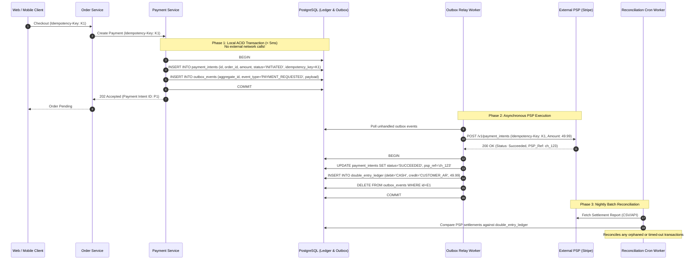

# Production System Design: Resilient Payment Processing Architecture

## 1. Architectural Principles
1. **Never Hold Database Transactions Across Remote Network Calls**: Separate local state persistence from remote HTTP calls.
2. **End-to-End Idempotency**: Propagate client-supplied `Idempotency-Key` headers through internal services down to the payment gateway (Stripe).
3. **Event-Driven Asynchronous Settlement**: Leverage the **Transactional Outbox Pattern** and double-entry accounting ledgers.
4. **Active Reconciliation Engine**: Periodically reconcile internal transaction states against payment provider settlement reports (webhook + batch reconciliation).

## 2. Component Architecture

## 3. Key Invariants & Trade-offs
- **Idempotency Table**: The `payment_intents` table enforces a `UNIQUE(idempotency_key)` constraint. Repeated requests within 24 hours immediately return the previously recorded payment status without re-charging the customer.
- **Connection Isolation**: DB transactions commit before contacting Stripe. HikariCP pool slots are held for $< 5\text{ms}$ instead of seconds.
- **Fault-Tolerant Retries**: If the worker crashes mid-flight, the outbox record is re-polled by another worker instance. The retry passes the same `Idempotency-Key: K1` to Stripe, which guarantees exactly-once charge execution at the banking gateway layer.
