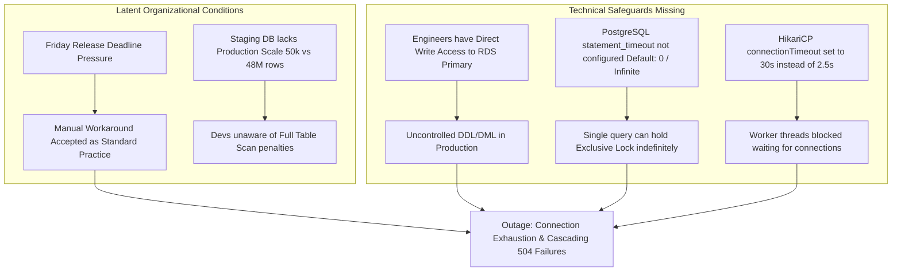

# Blameless Post-Mortem: Incident 4082 (Production Database Connection Exhaustion)

**Incident Date:** 2026-02-14  
**Impact Window:** 16:15 UTC – 16:57 UTC (42 minutes total degradation / outage)  
**Incident Commander (IC):** Lead SRE  
**Participants:** Backend Engineering Lead, DBA Specialist, Payment Team Engineers  
**Severity:** Sev-1 (Critical Business Impact)  

---

## 1. Executive Summary
On Friday, 2026-02-14 between 16:15 UTC and 16:57 UTC, the e-commerce checkout platform experienced complete degradation. Customers attempting to complete credit card purchases received HTTP 504 Gateway Timeouts. Approximately 1,420 checkout attempts failed, resulting in an estimated \$68,000 in delayed or abandoned transactions.

The failure occurred when a manual schema update executed an unindexed `ALTER TABLE orders ADD COLUMN legacy_ref VARCHAR(64)` concurrently with an unindexed backfill query `UPDATE orders SET legacy_ref = ... WHERE created_at > ...`. Because the `orders` table contains 48 million rows and lacked an index on `created_at`, the backfill triggered an exclusive table lock (`AccessExclusiveLock`) and a full table sequential scan. All application HikariCP connection pools saturated within 90 seconds while waiting on locked rows, cascading into HTTP 504 gateway timeouts across all upstream API gateways.

Normal operations were restored at 16:57 UTC after the blocking query was terminated via `pg_terminate_backend()`, connection pool thresholds were reset, and services stabilized.

---

## 2. Customer Impact & Business Metrics
- **Service Availability**: Checkout service availability dropped to 0.0% during the peak 30-minute window (SLO: 99.95%).
- **Failed Requests**: 1,420 orders timed out; 8,200 read queries returned HTTP 500/504 errors.
- **Estimated Revenue At Risk**: \$68,000 across 42 minutes.
- **Data Integrity**: Zero data corruption; all in-flight database transactions either completed or cleanly rolled back.

---

## 3. High-Resolution Incident Timeline (UTC)

| Time | Event Description | Telemetry / Source |
|---|---|---|
| **16:14** | An engineer initiated an ad-hoc SQL backfill query via SSH bastion host to populate `legacy_ref` ahead of a scheduled Monday marketing release. | PostgreSQL Audit Logs |
| **16:15** | PostgreSQL acquired an `AccessExclusiveLock` on `orders`. The sequential scan began consuming 100% CPU on the primary RDS instance. | CloudWatch RDS Metrics |
| **16:16** | Application instances exhausted their HikariCP connection pools (max: 20 per pod). Web threads blocked in `HikariPool.getConnection()`. | Datadog APM: Hikari Active Connections = 20/20 |
| **16:18** | Upstream AWS ALB initiated health check failures against backend pods due to unresponsiveness. Error rate climbed from 0.01% to 84%. | ALB Target Group 5xx Metric |
| **16:19** | PagerDuty triggered Sev-1 alert: *Checkout SLO Burn Rate > 14x over 5m window*. | PagerDuty #checkout-sev1 |
| **16:21** | Incident Commander convened the emergency incident bridge. Backend Lead and DBA on-call joined. | Slack #incident-4082 |
| **16:24** | IC initiated triage: CloudWatch showed RDS CPU at 99.8%, FreeableMemory dropping, and active lock waits exceeding 450 sessions. | CloudWatch RDS Dashboard |
| **16:28** | DBA queried `pg_stat_activity` and identified query PID 31822 executing an unindexed `UPDATE orders` holding `RowExclusiveLock` blocking 182 child transactions. | DBA Console Query |
| **16:32** | DBA attempted graceful query cancellation via `SELECT pg_cancel_backend(31822)`. Query failed to yield within 3 minutes due to heavy I/O rollback. | PostgreSQL Shell |
| **16:35** | IC approved hard termination: DBA executed `SELECT pg_terminate_backend(31822)`. RDS recovered CPU to 18%. | PostgreSQL Shell |
| **16:42** | Residual blocked application connections cleared; HikariCP connection pool reset triggered across all 8 backend pods. | Datadog APM Pool Metrics |
| **16:50** | Synthetic test orders placed successfully through staging and production canaries. | Synthetic Test Runner |
| **16:57** | Error rates dropped below 0.05%. IC declared incident mitigated. | Incident Bridge Closed |

---

## 4. Systemic Analysis & Contributing Factors (The "Second Story")

Traditional incident reviews stop at "an engineer ran an unindexed query". A resilient systems review investigates why our technical and organizational environment made this failure possible:

### 5 Whys Systemic Investigation
1. **Why did the checkout service fail?**  
   Application pods could not acquire database connections from HikariCP, leading to connection timeouts and thread pool exhaustion.
2. **Why was the connection pool exhausted?**  
   All available connections were blocked waiting for an exclusive row/table lock held by an ad-hoc background query.
3. **Why did the query hold locks for over 20 minutes?**  
   The query executed an unindexed full table scan across 48 million rows, and the database had no `statement_timeout` configured to abort long-running transactions.
4. **Why was an unindexed query run manually against production?**  
   The team lacked an automated schema migration pipeline (e.g. Flyway) for ad-hoc backfills, creating organizational reliance on manual bastion executions to meet marketing deadlines.
5. **Why was manual production write access permitted?**  
   IAM database authentication lacked least-privilege role separation: development roles shared read-write administrative credentials on the production cluster.

---

## 5. Preventative Action Items (SMART Remediation)

| Action Item | Type | Owner | Target Date | Tracking Ticket |
|---|---|---|---|---|
| **Configure PostgreSQL `statement_timeout = 5000` (5s)** for all transactional web application roles, and `30000` (30s) for batch roles. | Engineering Control | DBA Team | 2026-02-18 | INFRA-2104 |
| **Revoke direct write permissions to production RDS** for all individual developer accounts; mandate all DDL/DML run via automated CI/CD Flyway pipelines. | Security / IAM | DevOps Lead | 2026-02-22 | SEC-982 |
| **Reduce HikariCP `connectionTimeout`** from 30,000ms to 2,500ms, and configure fast-failing resilience circuit breakers. | Resilience / Config | Backend Lead | 2026-02-19 | PLAT-4401 |
| **Deploy Synthetic Canary Probes** executing simulated checkout transactions every 60 seconds to detect customer-facing degradation before SLO breach. | Observability | SRE Team | 2026-02-25 | SRE-812 |
| **Implement Staging Data Volume Anonymizer** to populate staging with representative data volume ($> 5\text{M rows}$) so engineers detect slow queries before production. | Testing / Infra | Data Team | 2026-03-05 | DATA-109 |
| **Publish Incident Command Runbook** detailing `pg_terminate_backend` triage protocol and automated lock inspection queries. | Operational | SRE Team | 2026-02-20 | SRE-815 |
